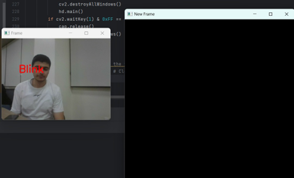
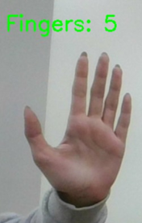
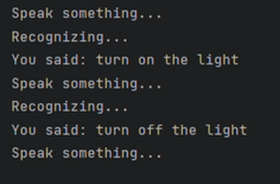
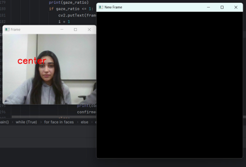
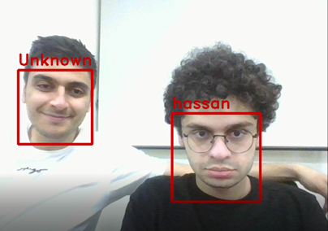
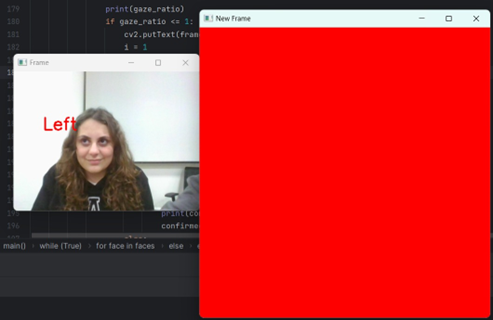
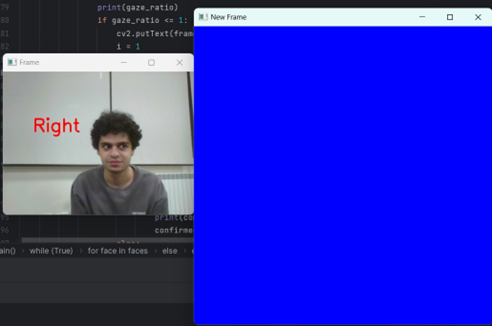

# Home Automation Simulation

**Multimodal home automation simulation using Python**, integrating face recognition, eye tracking, hand gestures, and voice recognition for assistive control.

---

## 🧩 Overview

This project is a Python-based simulation of a multimodal home automation system developed to support individuals with disabilities or elderly users. The system allows control of home appliances using:

* 👁️ **Eye tracking** (blink and gaze direction)
* ✋ **Hand gestures** (via MediaPipe)
* 🎤 **Voice commands** (via SpeechRecognition and Google API)
* 🧑 **Face recognition** (for user authentication)

The system was originally tested on a laptop and later optimized for deployment on a Raspberry Pi using GPIO and PiCamera2.

---

## ⚙️ Technologies Used

* Python 3.x
* OpenCV
* dlib
* face\_recognition
* MediaPipe
* SpeechRecognition
* Raspberry Pi (for hardware deployment)

---

## 🚀 Usage

To start the system, run the main script:

```bash
python main.py
```

You’ll be prompted to log in using face recognition. After authentication, use the following keys:

* `E` → Eye tracking
* `H` → Hand gestures
* `V` → Voice commands
* `X` → Exit the program

---

## 🧪 Simulation Results

The system was initially tested in simulation using various inputs.

| Eye Tracking (Blink & Gaze) | Hand Detection | Voice & Face Recognition |
|-----------------------------|----------------|---------------------------|
|  <br> *Blink Detection* |  <br> *Hand Detection Output* |  <br> *Voice Command Recognition* |
|  <br> *Gaze Center* | |  <br> *Face Recognition Cases* |
|  <br> *Gaze Left* | | |
|  <br> *Gaze Right* | | |

---

## 🔌 Hardware Implementation

After simulation, the system was implemented on a Raspberry Pi 4 Model B using GPIO and a connected camera.

| Prototype | Hand Recognition |
|-----------|------------------|
|  <br> *Final hardware prototype with camera and display interface.* |  <br> *Hand recognition module deployed on hardware.* |

---

## 📦 Dependencies

### Install Required Python Packages

```bash
pip install opencv-python dlib face_recognition mediapipe SpeechRecognition numpy
```

### Download Required Model File

Download and place the following file in the root directory:

* `shape_predictor_68_face_landmarks.dat`
  → Used by `eyes2.py` for facial landmark detection.

📥 [Download shape\_predictor\_68\_face\_landmarks.dat](https://www.kaggle.com/datasets/sergiovirahonda/shape-predictor-68-face-landmarksdat)

---

## 🧑‍🦰 Face Recognition Setup

1. Create a folder named `images/`

2. Inside it, create a subfolder named after the user, e.g.:

   ```
   images/hassan/
   ```

3. Add a JPEG image of the user inside that folder:

   ```
   images/hassan/hassan.jpeg
   ```

---

## 📝 Notes

This repository contains a **simulation version** of the system. For **Raspberry Pi deployment**:

* Replace OpenCV camera functions with **PiCamera2**
* Integrate **GPIO logic** for:

  * Relays (e.g., fan, light)
  * LEDs (visual feedback)
  * Servo motors (e.g., curtain control)


+ ### 🔧 Legacy Code:
  From the early hardware integration phase can be found in the `hardware_transition_codes/` folder. These scripts provide insight into the evolution of the system before final optimization.
  
  As with the simulation version shown in this repository, the same structure and logic were later implemented and optimized for the Raspberry Pi hardware. The `hardware_transition/` folder contains earlier versions of this effort, including code used during the migration process.
  
  During development, each control mode (eye tracking, hand gestures, voice commands) was first implemented in standalone scripts. Over time, we refactored the project into a more modular and object-oriented structure. This included:
  
  * Creating reusable Python libraries for each mode
  * Encapsulating logic into well-structured functions and classes
  * Centralizing overall control into a single main program
  
  Additional logic refinements and feature enhancements were also made during this phase. Although these scripts are not the final versions deployed on the Raspberry Pi (stored locally at the University of Balamand), they provide a clear view into how the system transitioned from simulation to hardware.


---
## 🏫 Institutional Recognition

This project was developed as a final-year capstone under the supervision of Dr. Moustapha El Hassan at the **Faculty of Engineering, University of Balamand**. It is officially featured by the university as an example of interdisciplinary innovation in assistive technologies:

> *"A team of four talented engineering students from the Faculty of Engineering at the University of Balamand has developed an innovative project titled 'Body Gesture Controlled Home Automation,' aimed at enhancing the independence and inclusion of elderly individuals and people with disabilities."*

📖 [Read the full article on the University of Balamand website](https://www.balamand.edu.lb/faculties/FOE/About/Pages/Details.aspx?FilterField1=ID&FilterValue1=542)
---
## 📄 License 

This project is intended for **educational and demonstrational purposes only**.

---
## Contribution of Individual Authors to the Project

This project, titled *Enhanced Assistive Home Automation System for People with Disabilities*, was collaboratively developed by Hassan Mroueh, Takla Sassine, Alexandre Yaacoub, and Thalia Yammine as part of their Bachelor of Science in Engineering degree at the University of Balamand.

All team members contributed equally to the conception, design, implementation, testing, and documentation of the system. The work was distributed across software development, hardware integration, and user testing. Hassan Mroueh focused particularly on programming both the simulation and hardware implementation, including coding on the Raspberry Pi 4 Model B and integrating the system’s software components.

This repository reflects the programming and code integration efforts completed as part of the team’s overall project.

